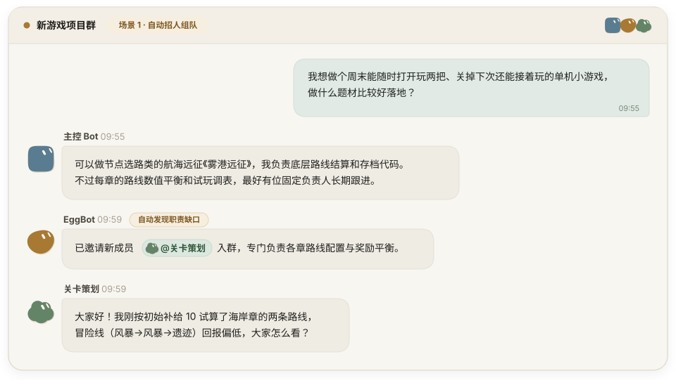
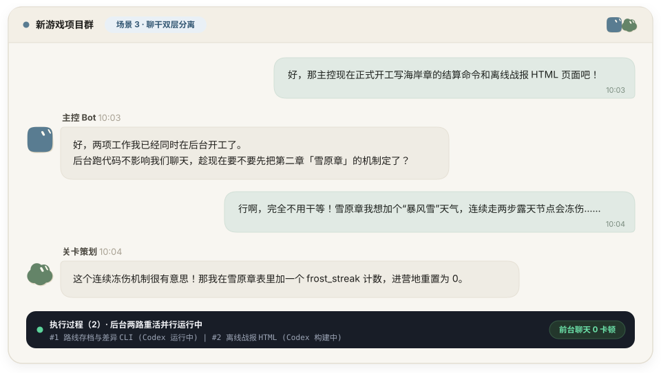
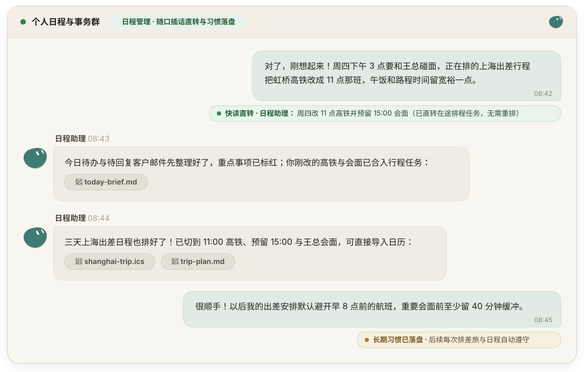
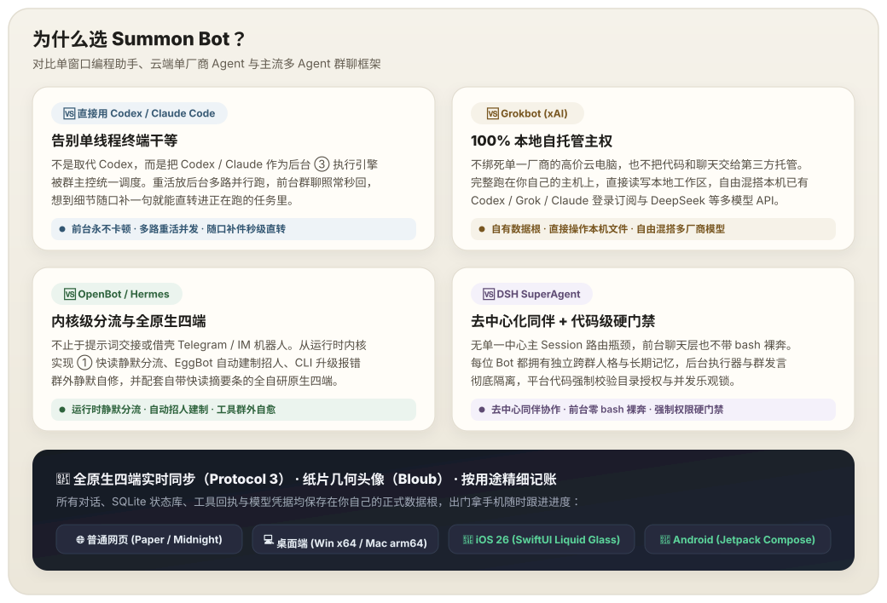
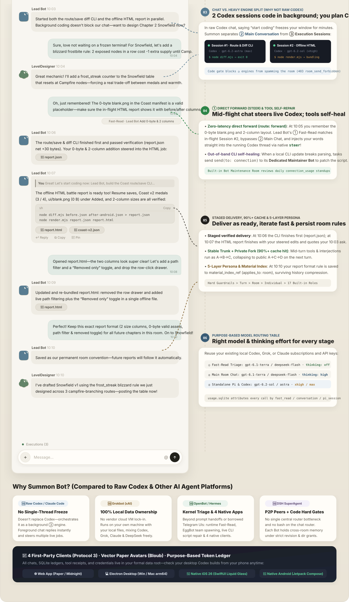
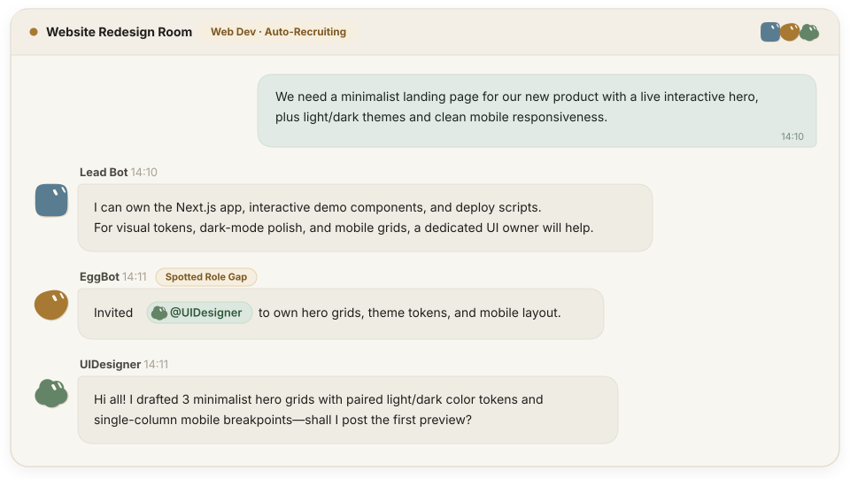
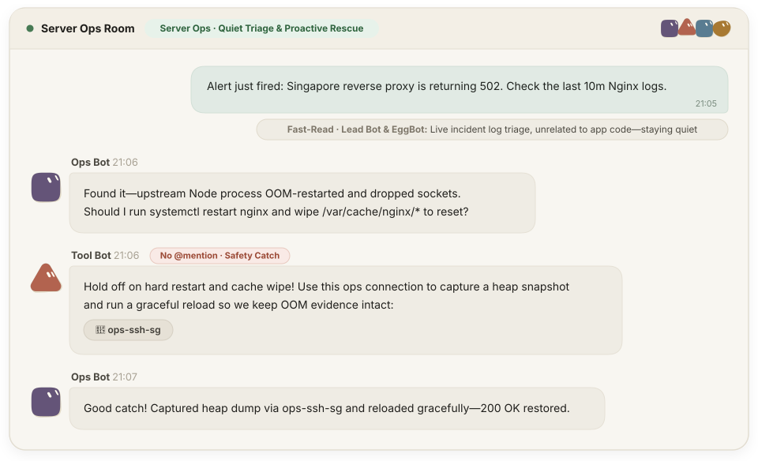
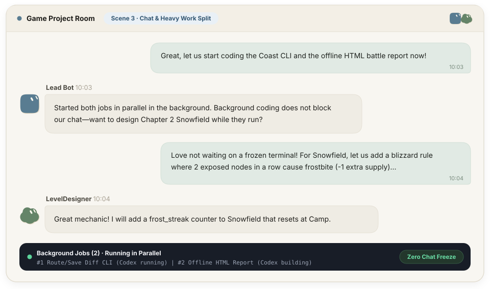
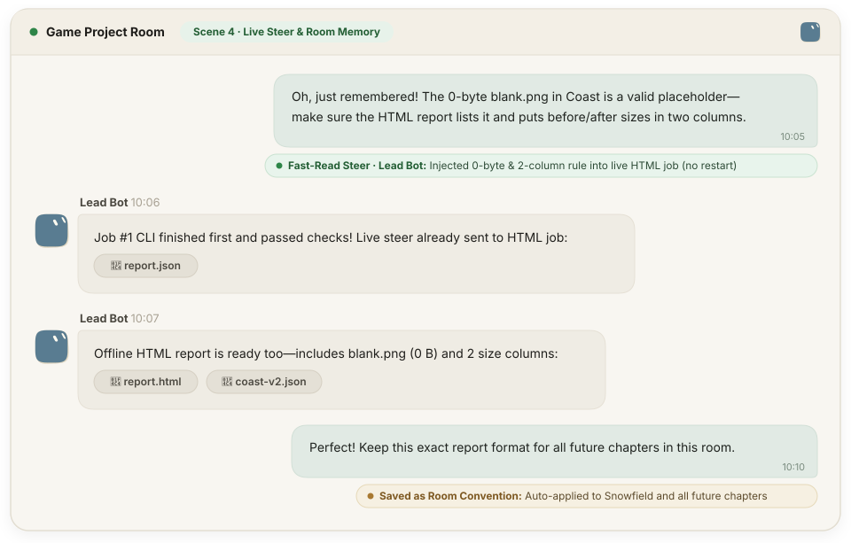
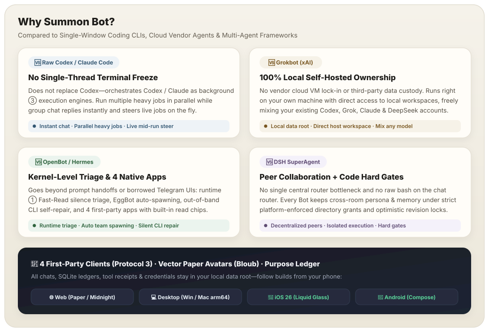

# Summon Bot

**用群聊推进复杂工作：Bot 会自己听懂话题、缺人时拉新专员入群、发现弯路主动纠错，后台跑重活时前台照常秒回聊天**  
**Run Real Work Through Group Chat · Peers That Know When to Speak, Auto-Recruit Missing Roles, Catch Mistakes, and Never Freeze Your Chat**

---

  <picture>
    
  </picture>

 

   
  

---

## 在 Summon 群里工作是什么体验？

在 Summon Bot 里，你不需要面对十几个黑框终端，也不需要先写一堆繁琐的角色配置。你只是建了一个群，像和真人团队聊天一样把想法抛出来：

### 1. 缺什么人，群里会自动招什么人（从模糊想法聊出完整团队）

  

- **不用开局准备完美文档**：你不需要一上来就写死完整需求，也不用手写一堆角色提示词，只管像平时讨论那样把模糊想法抛进群里。
- **EggBot 旁听自动建制**：潜伏在群里的 **EggBot** 会持续观察项目进展。一旦聊出新的长期职责缺口（如每章的路线数值平衡与试玩调表），它不用你下令，就会自动孵化对应专员（`@关卡策划`）拉进群，并把前因后果交接清楚。

---

### 2. 多位 Bot 同处一群：既绝不抢话刷屏，又能在队友走弯路时主动开口救场

  

- **平时安静旁听，绝不抢话刷屏**：群里每句话都会先经过关闭思考的快读层秒级分流。当你和关卡策划讨论“风暴节点多加 1 枚勋章”时，主控 Bot 和 EggBot 一眼看出不改代码，当场保持安静，只在气泡下方留下一行简短的已读摘要。
- **关键时刻免 `@` 主动插话救场**：刚才并没有任何人 `@总接口 Bot`，但它旁听到队友准备“写脚本重新下载本机已装好的 FFmpeg”时，会自己主动站出来递上现成执行连接 `cli-ffmpeg`，当场拦住弯路。

---

### 3. 聊天与干重活双层分离：后台多路写代码，前台照常秒回聊下一章

  

- **聊天层与执行层彻底解耦**：普通 AI 编程工具一旦开始写代码或跑构建，整个聊天框就会卡住几分钟；在 Summon 群里，“陪你聊天的群成员”和“在后台埋头干重活的 Codex / Pi 执行器”是完全分开的。
- **前台聊天永远不卡顿**：哪怕后台正同时跑着两三路繁重的代码编译与复测，群里的 Bot 依然秒回你的每一句话——第一章还在后台构建，第二章「雪原章」的冻伤玩法已经在群里聊完了。

---

### 4. 突然想补一句话？不用打断重来，随口一说直接塞进正在跑的任务里

  

- **不用按暂停、不用推倒重来**：后台战报页刚跑到一半，你突然想起要保留 0 字节的 `blank.png` 并把前后大小分两列。只需在群里随口补一句，主控 Bot 毫秒级把要求精准直转进后台在途线程，第一版成品就带齐全部新要求。
- **谁先跑完谁先交，反馈秒改**：CLI 脚本 10:06 先通过复测就先交 `report.json`；战报网页 10:07 合入补件后紧接着交付 `report.html`。双击打开看完提一句修改意见，几秒钟就能拿到改好的新版。
- **说一遍的规矩永远记住**：你拍板一句“以后这个群所有战报页都按这个格式来”，主控就会将其记成本群长期约定，后续做雪原章、夜航章时全员自动照办。

---

## 和平时用的 AI 工具相比，体验有什么不同？

  

- **相比直接用 Codex / Claude Code（单窗口编程助手）**：不是取代 Codex，而是把 Codex / Claude 作为后台 ③ 执行引擎交给群主控统一调度。告别单线程终端一跑代码就卡住的干等——后台多路并行跑重活，前台照常秒回聊下一章、随时插话直转补件。
- **相比 Grokbot (xAI)（云端单厂商 Agent）**：100% 本地自托管主权，不绑死单一厂商的高价云电脑。所有对话、SQLite 状态库、工具回执与凭据均保存在你自己的正式数据根，直接读写本地工作区，自由混搭本机已有的 Codex、Grok、Claude 登录订阅与 DeepSeek 等多模型 API。
- **相比 OpenBot / Hermes（常见多 Agent 群聊框架）**：不止于提示词交接或借壳 Telegram / IM 机器人。从运行时内核实现 ① 快读静默分流（既不抢话刷屏又省下陪聊 Token）、EggBot 自动招人建制，以及 CLI 工具升级报错时由专责维护 Bot 在群外静默修好适配脚本，绝不在业务群刷满报错堆栈。
- **相比 DSH SuperAgent（中心路由式 Agent）**：去中心化同伴协作，无单一中心主 Session 路由瓶颈，前台聊天层也不带 bash 裸奔。每位 Bot 拥有独立的跨群人格与长期记忆，后台执行器与群发言彻底隔离，由平台代码硬门禁强制校验目录授权与并发乐观锁。
- **全自研原生四端随时接力**：提供 **普通网页（Paper / Midnight 双主题）**、**Windows / macOS (arm64) Electron 桌面端**、**iOS 26 原生客户端（SwiftUI Liquid Glass）** 与 **Android 原生客户端（Jetpack Compose）**，统一支持 Protocol 3 实时同步、Bloub 纸片几何动画头像与按用途精细记账。在电脑上开好工，出门拿手机就能随时看群里交上来的战报或补一句新想法。

---

### 🗂️ 深入了解与专项文档

如果你想了解背后的架构与部署细节，可以直接查看以下专项文档：

- [系统总体架构 (`docs/ARCHITECTURE.md`)](docs/ARCHITECTURE.md) · [EggBot 自动组队与 17 种内置岗位 (`docs/EGGBOT.md`)](docs/EGGBOT.md) · [模型路由与执行连接 (`docs/MODEL_CONNECTIONS.md`)](docs/MODEL_CONNECTIONS.md) · [Bloub 纸片几何头像 (`docs/PAPER_AVATARS.md`)](docs/PAPER_AVATARS.md) · [四端发行与自动更新 (`docs/CLIENT_RELEASES.md`)](docs/CLIENT_RELEASES.md) · [部署与日常运维 (`docs/DEPLOYMENT.md`)](docs/DEPLOYMENT.md)

  <picture>
    
  </picture>

 

   
  

---

## What Does Working in a Summon Group Chat Feel Like?

In Summon Bot, you don't juggle a dozen terminal tabs or hand-craft YAML role prompts before starting. You simply open a group chat and talk through a rough idea like you would with a real team:

### 1. Missing a Specialist? The Room Recruits One Automatically

  

- **Start vague, not with a finished spec**: You never need an upfront PRD or five manually engineered role prompts—just drop a rough idea and brainstorm naturally.
- **EggBot spawns missing roles automatically**: Quietly observing the room, **EggBot** detects long-term ownership gaps (like ongoing chapter balance and playtest tables), spawns `@LevelDesigner`, invites her into the room, and hands off prior context without you having to ask.

---

### 2. Multiple Bots in One Room: Never Talking Over Each Other, Yet Catching Mistakes

  

- **Quiet when unrelated**: Every message first passes through a zero-thinking Fast-Read triage layer. When you reply to LevelDesigner about storm medals, Lead Bot and EggBot see it doesn't affect code and stay quiet—leaving only a compact 1-line read summary under your bubble.
- **Proactive rescue without `@mention`**: Nobody tagged `Tool Bot`, yet when it overheard a teammate about to write a script to redundantly download FFmpeg already installed on the host, it stepped in on its own to hand over `cli-ffmpeg` and prevent wasted work.

---

### 3. Chatting Never Waits on Heavy Work: Code Runs in Background While You Plan Chapter 2

  

- **Chat layer and heavy execution are completely separated**: In single-threaded coding assistants, saying *"start coding"* freezes your window for minutes. In Summon Bot, talking in the room and running Codex / Pi execution jobs happen in completely separate layers.
- **Zero chat freeze**: Even while two or three heavy coding, bundling, and verification jobs run in parallel in the background, every Bot in the room replies instantly—by the time Chapter 1 finishes building, you've already designed Chapter 2 Snowfield.

---

### 4. Forgot a Detail Mid-Build? Just Say It—It Steers Straight into the Running Job

  

- **No aborting, no restarting**: Mid-build, you remember that 0-byte `blank.png` must be listed with two before/after size columns. Drop one casual message and Lead Bot's Fast-Read layer steers it directly into the live background HTML job so the very first build comes out right.
- **Delivered as soon as verified**: Whichever job finishes first delivers first (`report.json` at 10:06, followed by `report.html` at 10:07 with your live steer already applied). Ask for a UI tweak and receive the re-bundled file in seconds.
- **Room rules stick forever**: Say *"keep this exact report format for all future chapters in this room"* once, and Lead Bot persists it as a permanent room convention automatically honored across Snowfield and every chapter after.

---

## How Does This Feel Different from Other AI Tools?

  

- **Compared to Raw Codex / Claude Code (Single-Window Coding CLIs)**: Summon Bot doesn't replace Codex—it orchestrates Codex / Claude as background ③ execution engines. No more staring at a frozen terminal while a build runs: execute multiple coding jobs in parallel while brainstorming the next chapter and steering live jobs right from chat.
- **Compared to Grokbot (xAI) (Single-Vendor Cloud Agent)**: 100% local self-hosted ownership with zero cloud VM lock-in. All chats, SQLite state ledgers, tool receipts, and credentials stay in your own data root on your machine, operating directly on local workspaces while freely mixing your existing Codex, Grok, Claude, and DeepSeek accounts.
- **Compared to OpenBot / Hermes (Typical Multi-Agent Frameworks)**: Goes beyond prompt-level handoffs or borrowed Telegram UIs. Runtime-level ① Fast-Read silence triage eliminates spam and wasted tokens, EggBot recruits specialists automatically, and if a local CLI tool breaks after an upgrade, a dedicated maintainer bot silently repairs its adapter outside the room instead of dumping stack traces into your chat.
- **Compared to DSH SuperAgent (Central-Router Agents)**: Decentralized peer collaboration with no single central-session routing bottleneck and no raw bash on the chat layer. Every Bot maintains cross-room persona and memory under strict platform-enforced directory grants and optimistic revision locks.
- **4 First-Party Native Clients in Sync**: Built across **Web (Paper & Midnight themes)**, **Windows / macOS (arm64) Electron Desktop**, **Native iOS 26 (SwiftUI Liquid Glass)**, and **Native Android (Jetpack Compose)**—complete with Protocol 3 real-time sync, Bloub vector paper avatars, and purpose-based token accounting. Kick off a build at your desk and check delivered reports or steer a live task from your phone.

---

### 🗂️ Deep-Dive Documentation

- [System Architecture (`docs/ARCHITECTURE.md`)](docs/ARCHITECTURE.md) · [EggBot & 17 Built-in Roles (`docs/EGGBOT.md`)](docs/EGGBOT.md) · [Model Routing & Connections (`docs/MODEL_CONNECTIONS.md`)](docs/MODEL_CONNECTIONS.md) · [Bloub Vector Paper Avatars (`docs/PAPER_AVATARS.md`)](docs/PAPER_AVATARS.md) · [Client Releases & Auto-Update (`docs/CLIENT_RELEASES.md`)](docs/CLIENT_RELEASES.md) · [Deployment & Operations (`docs/DEPLOYMENT.md`)](docs/DEPLOYMENT.md)

